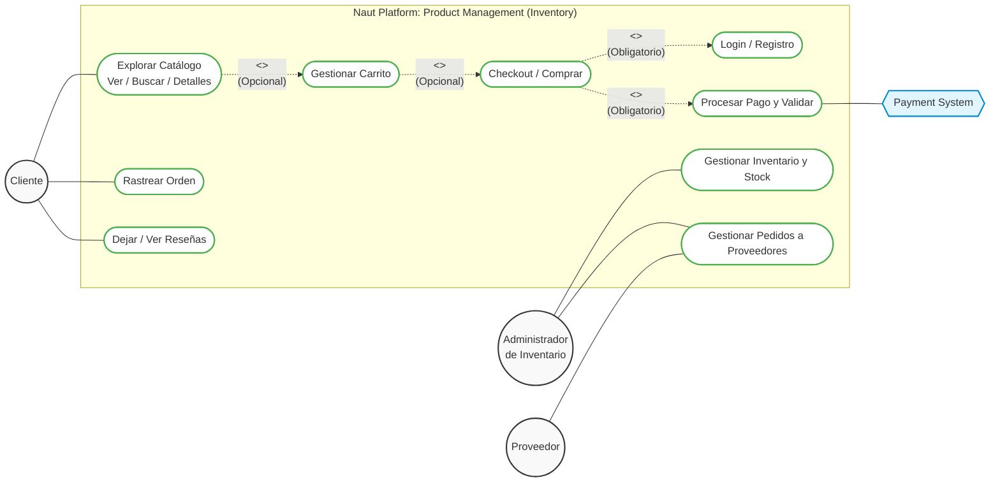

# Product Management (Inventory) - Use Cases

This document outlines the core use cases and actors for the "Product Manejo" inventory module of the Naut Platform.

## Actors
- **Cliente (Customer)**: End-user browsing products and making purchases.
- **Administrador de Inventario (Admin)**: User responsible for maintaining stock levels and ordering from suppliers.
- **Proveedor (Supplier)**: External entity fulfilling restock orders.

## System Interfaces
- **Payment System**: External system for processing customer payments.

## Use Case Diagram

