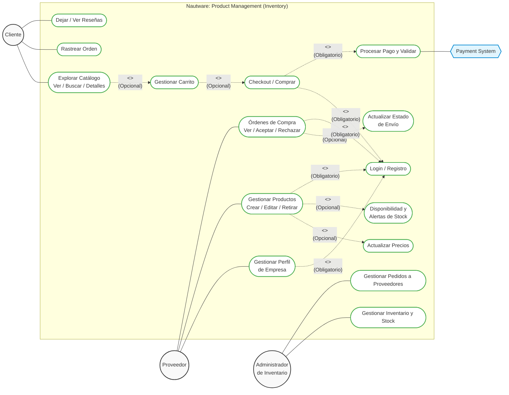

# Product Management (Inventory) - Use Cases

This document outlines the core use cases and actors for the "Product Manejo" inventory module of Nautware.

## Actors
- **Cliente (Customer)**: End-user browsing products and making purchases.
- **Administrador de Inventario (Admin)**: User responsible for maintaining stock levels and ordering from suppliers.
- **Proveedor (Supplier)**: External entity fulfilling restock orders and managing their product catalog.

## System Interfaces
- **Payment System**: External system for processing customer payments.

## Casos de Uso por Actor

### Proveedor (Supplier)
- **Gestionar Perfil de Empresa**: Actualizar datos, información fiscal, de contacto y políticas de envío.
- **Gestionar Productos**: Crear nuevos productos, editar detalles (descripciones, fotos, especificaciones) o retirar productos del catálogo.
- **Actualizar Precios**: Modificar los precios de venta de sus productos.
- **Gestionar Stock y Alertas**: Actualizar la disponibilidad de inventario y configurar/recibir alertas de escasez.
- **Gestionar Órdenes de Compra**: Ver órdenes de reabastecimiento solicitadas por el Administrador, con la capacidad de aceptarlas o rechazarlas.
- **Actualizar Estado de Envío**: Proveer seguimiento de los pedidos aceptados y cambiar el estado (ej. Procesando, Enviado, Entregado).

## Use Case Diagram

```mermaid
flowchart LR
    %% Definición de estilos
    classDef actor fill:#f9f9f9,stroke:#333,stroke-width:2px;
    classDef system fill:#e1f5fe,stroke:#0288d1,stroke-width:2px;
    classDef usecase fill:#ffffff,stroke:#4caf50,stroke-width:2px;

    %% Actores
    Cliente((Cliente)):::actor
    Admin((Administrador\nde Inventario)):::actor
    Proveedor((Proveedor)):::actor
    PaymentSys{{Payment System}}:::system

    %% Frontera del Sistema
    subgraph Naut_Platform ["Nautware: Product Management (Inventory)"]
        direction TB
        
        %% Casos de Uso del Cliente
        UC_Catalogo([Explorar Catálogo\nVer / Buscar / Detalles]):::usecase
        UC_Cart([Gestionar Carrito]):::usecase
        UC_Checkout([Checkout / Comprar]):::usecase
        UC_Auth([Login / Registro]):::usecase
        UC_Track([Rastrear Orden]):::usecase
        UC_Review([Dejar / Ver Reseñas]):::usecase

        %% Casos de Uso del Admin
        UC_Stock([Gestionar Inventario y Stock]):::usecase
        UC_Restock([Gestionar Pedidos a Proveedores]):::usecase
        
        %% Casos de Uso del Proveedor
        UC_SupPerfil([Gestionar Perfil\nde Empresa]):::usecase
        UC_SupProd([Gestionar Productos\nCrear / Editar / Retirar]):::usecase
        UC_SupPrice([Actualizar Precios]):::usecase
        UC_SupStock([Disponibilidad y\nAlertas de Stock]):::usecase
        UC_SupOrders([Órdenes de Compra\nVer / Aceptar / Rechazar]):::usecase
        UC_SupShipping([Actualizar Estado\nde Envío]):::usecase

        %% Procesos Internos
        UC_Pay([Procesar Pago y Validar]):::usecase

        %% Relaciones Lógicas (Include / Extend)
        UC_Catalogo -. "<<extend>>\n(Opcional)" .-> UC_Cart
        UC_Cart -. "<<extend>>\n(Opcional)" .-> UC_Checkout
        UC_Checkout -. "<<include>>\n(Obligatorio)" .-> UC_Auth
        UC_Checkout -. "<<include>>\n(Obligatorio)" .-> UC_Pay

        %% Relaciones Lógicas del Proveedor
        UC_SupProd -. "<<extend>>\n(Opcional)" .-> UC_SupPrice
        UC_SupProd -. "<<extend>>\n(Opcional)" .-> UC_SupStock
        UC_SupOrders -. "<<extend>>\n(Opcional)" .-> UC_SupShipping
        
        UC_SupProd -. "<<include>>\n(Obligatorio)" .-> UC_Auth
        UC_SupOrders -. "<<include>>\n(Obligatorio)" .-> UC_Auth
        UC_SupPerfil -. "<<include>>\n(Obligatorio)" .-> UC_Auth
    end

    %% Conexiones de Actores a Casos de Uso
    Cliente --- UC_Catalogo
    Cliente --- UC_Track
    Cliente --- UC_Review

    Admin --- UC_Stock
    Admin --- UC_Restock
    
    %% Conexiones del Proveedor
    Proveedor --- UC_SupPerfil
    Proveedor --- UC_SupProd
    Proveedor --- UC_SupOrders

    %% Conexión a Sistemas Externos
    UC_Pay --- PaymentSys
```
